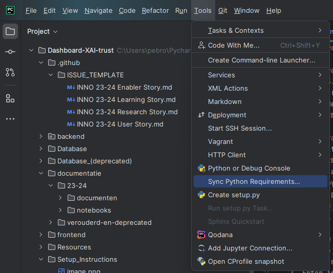
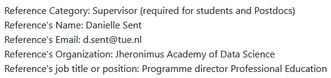

# Dashboard Setup

## Required software to install
- Python 3.9, 3.10 or 3.11
- Node.js (Latest stable version)
- NPM (Node Package Manager)
- IDE (PyCharm is recommended)

## Steps to start the dashboard
1.  Clone the repository to your local machine. [Instructions](https://docs.github.com/en/repositories/creating-and-managing-repositories/cloning-a-repository#cloning-a-repository)
2.  Open the repository in your IDE.
3. Create a virtual environment in the root of the repository using the requirements.txt file. [Instructions](https://docs.python.org/3/library/venv.html)
4. if on pycharm follow these instructions. 
   1. Add python interpreter in pycharm.
   2. Sync requirement.txt that is located in the setup_instructions. 
   3. 
   4. if for some reason this option doesnt work do this command **pip install -r ./Setup_instructions/requirements.txt**.
5. Install the Node.js packages in the frontend folder using the package.json file using the command: **npm install --force** [Furthur Instructions](https://docs.npmjs.com/cli/v7/commands/npm-install)
   1. First up open a new commandline and do: **cd ./frontend**
   2. And then do the following command: **npm install --force**

# Starting up the dashboard
1. Run the file `run.py` in the map labeled “backend” (i.e (<Projectroot>\Dashboard-XAI-trust\backend\run.py). 
2. Open a new terminal in the IDE.
3. Enter in the new terminal `cd ./frontend`. 
4. Enter `npm start`. 

The dashboard should now be running and can be accessed by going to the following URL: http://localhost:3000/.

#  Getting the SAD data from MIMIC-IV
1. The data needed for the SAD model is on this [Github repo](https://github.com/bbycat927/SAD). Download and unzip the ZIP of the repo and use pandas with the command `pd.read_strata('path_to_MIMIC-IV.dta')` to load the data into a pandas dataframe.

# Why MIMIC-IV?

MIMIC-IV is a large dataset that contains over 2 million records of patients admitted in the ICU in the United States. The dataset contains a wide range of information about the patients, such as demographics, vital signs, lab results, and more.

There exists a lot of research on the MIMIC-IV dataset, due to this you can find a lot of papers and articles that can help you understand the dataset and how to use it. We used the paper called "
**Development of a machine
learning‑based prediction model
for sepsis‑associated delirium
in the intensive care unit**" where they used the MIMIC-IV dataset to predict Sepsis-associated delirium (SAD) in the ICU. We have used the same dataset to recreate the model and visualize the results in the dashboard.

The dataset is free to use but requires a account and doing a little course on the website to access and download the data. See the following steps to get access to the data.

# Getting access to MIMIC-IV
1. Go to [PhysioNet.org](https://physionet.org/) You will need to make an account and you will be asked to provide a form containing your personal information, a brief description of your intended use of the data and provide the email adress associated with product owner mostly the one of Danielle d.sent@tue.nl. Account completion can take a few days.
     
   Here is a piece of the form you will need to fill out:
   
     

2. After you gain access. You will need to complete this course [CITI Course Tutorial](https://physionet.org/about/citi-course/). after you complete the course and added the certification to your account. you will be able to download the data.

3. Download the MIMIC-IV data from the [PhysioNet website](https://physionet.org/content/mimiciv/2.2/). You will need 7zip to extract the .gz files.

4. Extract the files into the `Database/csv_data` directory. The files should be in .csv format. if the folder does not exist, create it in the `Database` directory.

5. You can now use the data to progress with the project.

